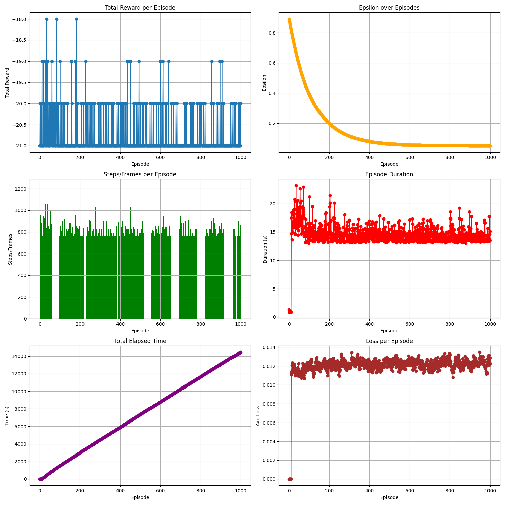
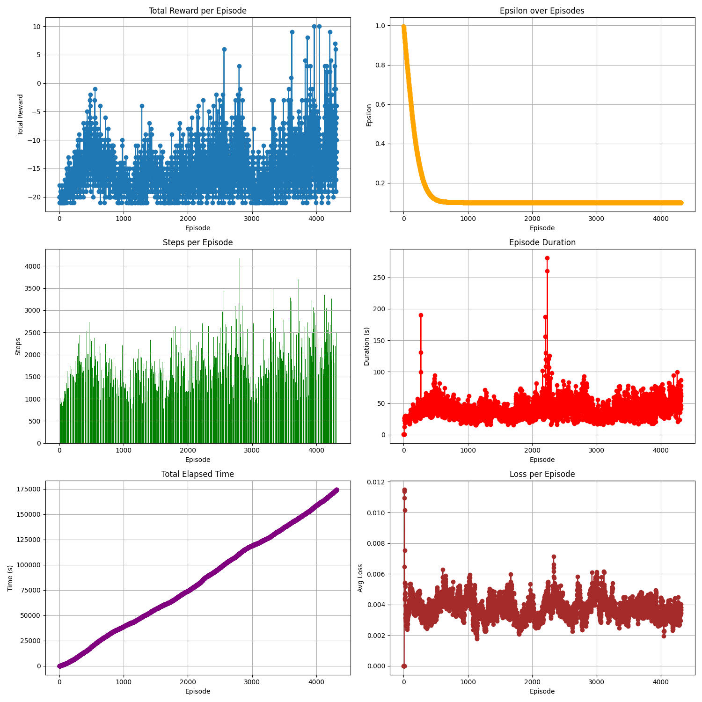
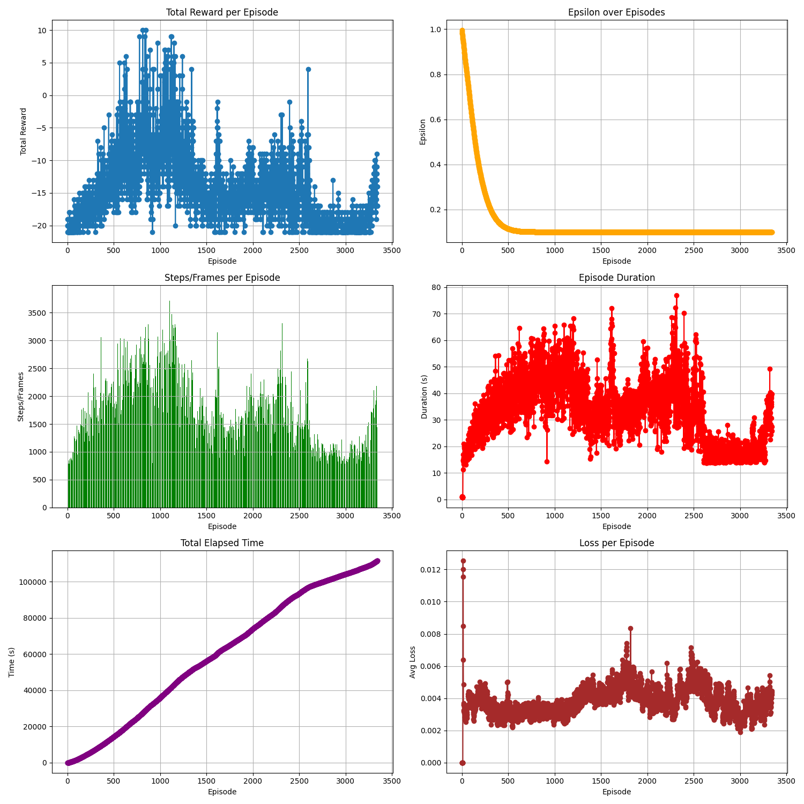
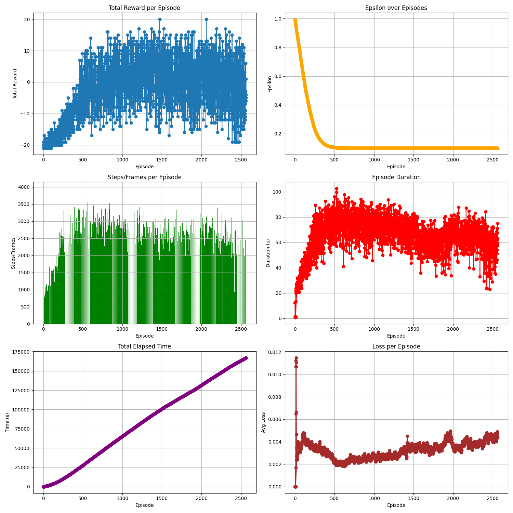
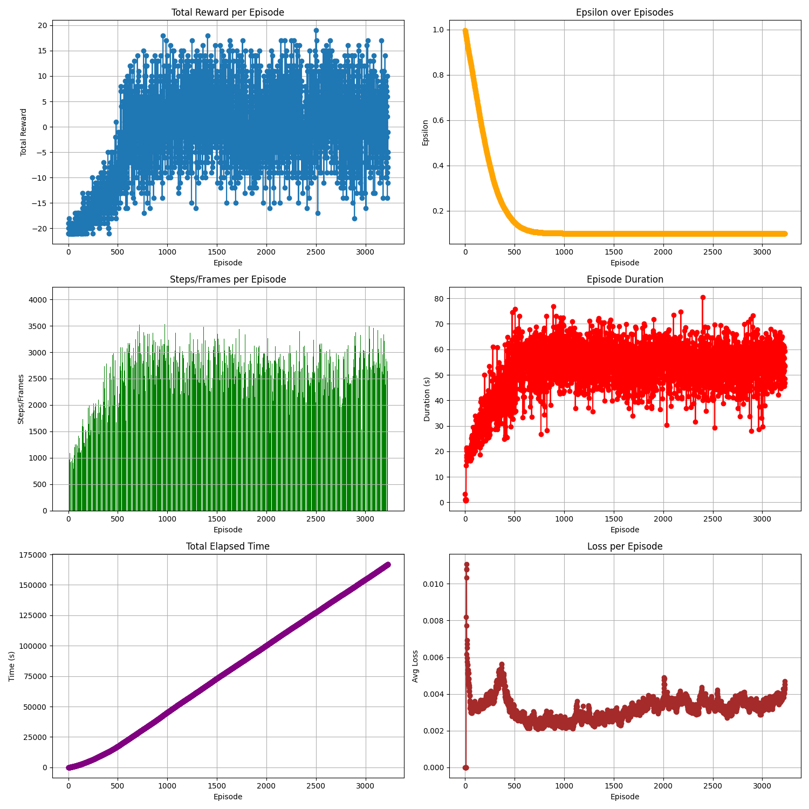
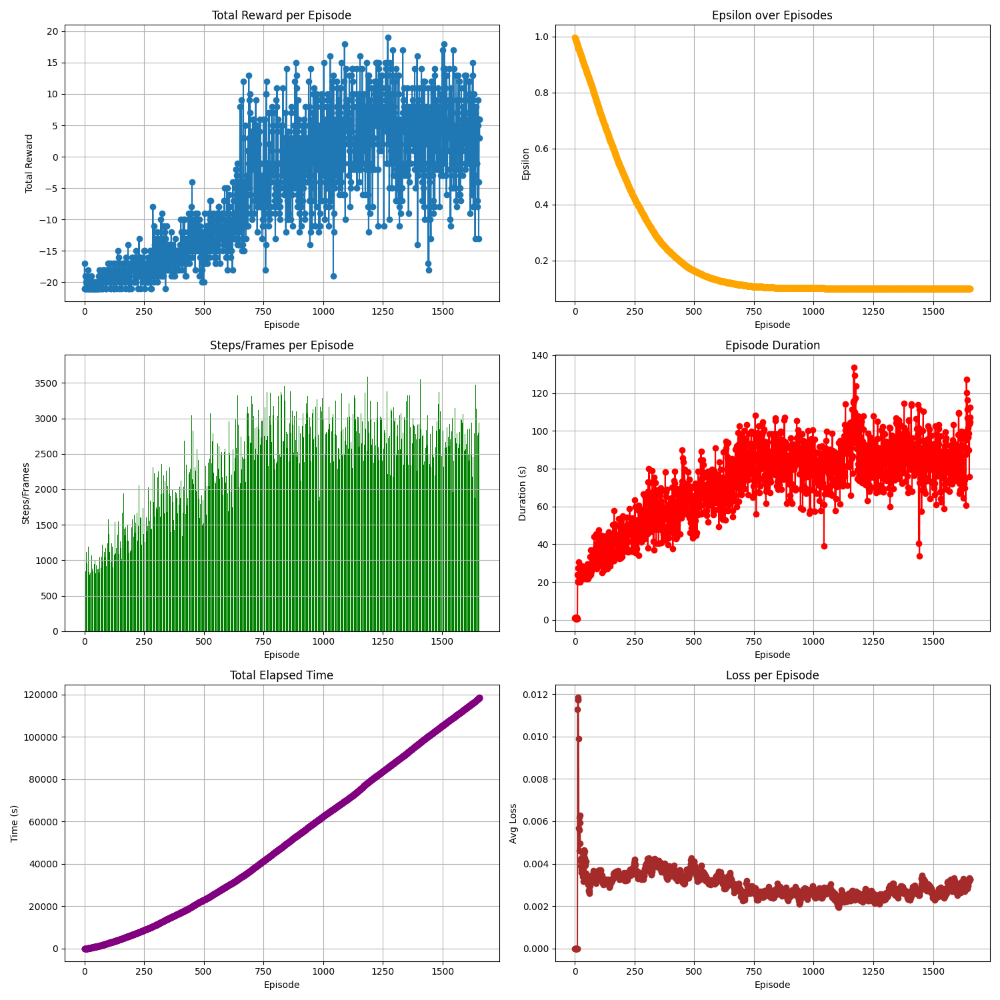
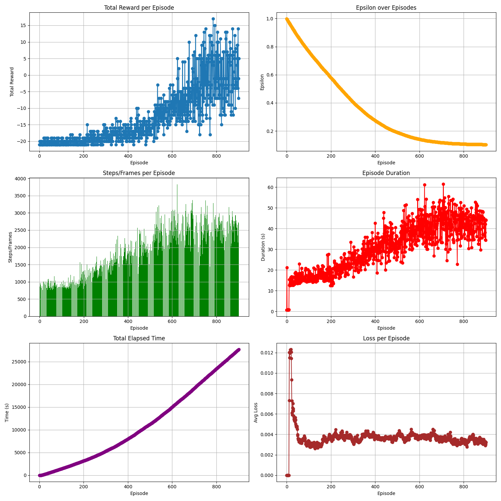
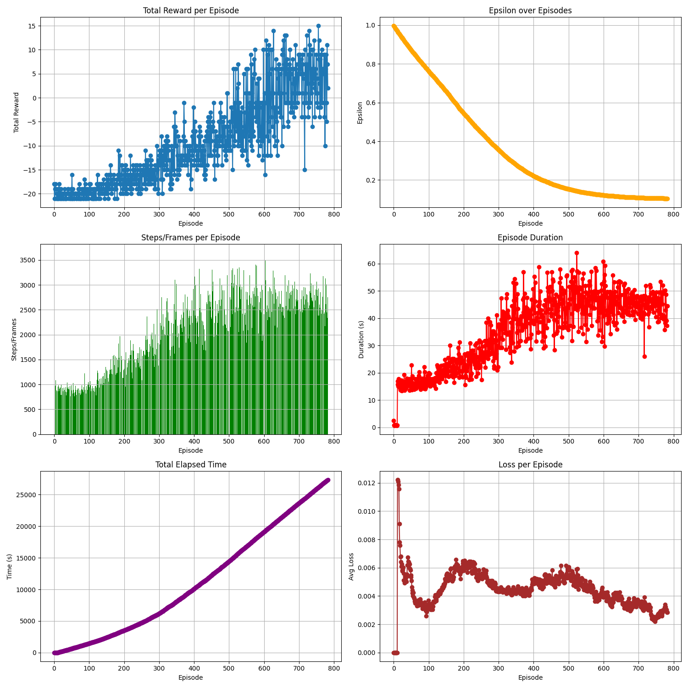

# Deep Q-Learning on Atari Pong

Training an RL agent to play **Atari Pong** using **Deep Q-Networks (DQN)**, plus **Double DQN**, and optional **difficulty scaling** (difficulty 2 and 3). Built on **Gymnasium + ALE** and a classic CNN Atari-style architecture.

<video src="https://github.com/user-attachments/assets/5df7173a-39dc-46ee-9927-d2ffbcd1bd67" controls width="600">
  Your browser does not support the video tag.
</video>

---

## Contents

- [Project layout](#project-layout)
- [Install](#install)
- [Environment](#environment)
- [Methods](#methods)
- [Experiments and results](#experiments-and-results)
  - [Baseline DQN experiments (1–5)](#baseline-dqn-experiments-15)
  - [Extra credit: Double DQN](#extra-credit-double-dqn)
  - [Extra credit: Difficulty 2 and 3](#extra-credit-difficulty-2-and-3)
- [Run training](#run-training)
- [Evaluate a saved model](#evaluate-a-saved-model)
- [Hyperparameter sweeps](#hyperparameter-sweeps)
- [Artifacts, videos, and what gets committed](#artifacts-videos-and-what-gets-committed)
- [Notes](#notes)
- [License](#license)

---

## Project layout

```
pong-dqn/
├─ README.md
├─ LICENSE
├─ requirements.txt
├─ .gitignore
│
├─ docs/
│  ├─ report.md
│  ├─ figures/
│  └─ videos/
│
├─ src/
│  ├─ env.py
│  ├─ preprocess.py
│  ├─ replay_buffer.py
│  ├─ models.py
│  ├─ agent.py
│  ├─ train.py
│  ├─ evaluate.py
│  ├─ config.py
│  └─ utils.py
│
├─ scripts/
│  ├─ train_dqn.py
│  ├─ train_double_dqn.py
│  ├─ train_difficulty.py
│  ├─ eval.py
│  └─ sweep.py
│
├─ experiments/
│  ├─ README.md
│  └─ .gitkeep
│
├─ models/
│  ├─ README.md
│  └─ .gitkeep
│
└─ tests/
   ├─ test_preprocess.py
   ├─ test_replay_buffer.py
   └─ test_model_shapes.py
```

---

## Install

### 1) Create and activate a virtual environment
```bash
python -m venv .venv
source .venv/bin/activate
```

### 2) Install dependencies
```bash
pip install -r requirements.txt
```

### 3) Quick sanity check
```bash
pytest -q
```

---

## Environment

- **Gymnasium ALE** environment: `ALE/Pong-v5`
- Observations: raw RGB frames (210×160×3)
- Actions: discrete actions (usually 6 for Pong)
- Preprocessing:
  - grayscale → 84×84
  - normalize to `[0, 1]`
  - stack 4 frames → `(4, 84, 84)` for temporal context

---

## Methods

### DQN (Value Function Approximation for Q-Learning)
We approximate **Q(s, a)** with a convolutional neural network:

- Conv(32, 8×8, stride 4) + ReLU  
- Conv(64, 4×4, stride 2) + ReLU  
- Conv(64, 3×3, stride 1) + ReLU  
- FC(256) + ReLU  
- Output layer: Q-values for each action  

Key training components:
- **Experience replay**
- **Target network** (periodic hard updates)
- **Epsilon-greedy exploration** with exponential decay
- **Huber loss** (`SmoothL1Loss`) for stability
- **Gradient accumulation** (default: 4 steps) to emulate larger batches more stably

### Double DQN
Same network, but target computation uses:
- action selection from the **policy network**
- action evaluation from the **target network**
to reduce overestimation bias.

---

## Experiments and results

### Baseline DQN experiments (1–5)

#### Hyperparameter selection summary
The progression focused on:
- Increasing **gamma** from 0.95 → 0.99 (more long-term value in Pong)
- Slower and broader exploration: epsilon from 1.0 → 0.1, decayed over 200k–300k steps
- Lower learning rate: `5e-4` → `1e-4` for stability
- Larger FC layer: 64/128 → 256 hidden units
- Larger replay: 10k → 50k transitions for diversity

---

#### Experiment 1
| FC Hidden Units | num_episodes | Replay Buffer | Gamma | Learning Rate | Initial Epsilon | Final Epsilon | Epsilon Decay |
|---:|---:|---:|---:|---:|---:|---:|---:|
| 128 | 1000 | 10000 | 0.95 | 5e-4 | 0.9 | 0.05 | 100000 |

**Plot:**  


---

#### Experiment 2
| FC Hidden Units | num_episodes | Replay Buffer | Gamma | Learning Rate | Initial Epsilon | Final Epsilon | Epsilon Decay |
|---:|---:|---:|---:|---:|---:|---:|---:|
| 64 | 4000+ | 10000 | 0.99 | 1e-4 | 1.0 | 0.1 | 200000 |

**Plot:**  


---

#### Experiment 3
| FC Hidden Units | num_episodes | Replay Buffer | Gamma | Learning Rate | Initial Epsilon | Final Epsilon | Epsilon Decay |
|---:|---:|---:|---:|---:|---:|---:|---:|
| 256 | 3000+ | 10000 | 0.99 | 1e-4 | 1.0 | 0.1 | 200000 |

**Plot:**  


---

#### Experiment 4
| FC Hidden Units | num_episodes | Replay Buffer | Gamma | Learning Rate | Initial Epsilon | Final Epsilon | Epsilon Decay |
|---:|---:|---:|---:|---:|---:|---:|---:|
| 256 | 2500+ | 50000 | 0.99 | 1e-4 | 1.0 | 0.1 | 200000 |

**Plot:**  


---

#### Experiment 5
| FC Hidden Units | num_episodes | Replay Buffer | Gamma | Learning Rate | Initial Epsilon | Final Epsilon | Epsilon Decay |
|---:|---:|---:|---:|---:|---:|---:|---:|
| 256 | 3000+ | 50000 | 0.99 | 1e-4 | 1.0 | 0.1 | 300000 |

**Plot:**  


---

#### Overview table (experiments 1–5)
| Parameter | Exp1 | Exp2 | Exp3 | Exp4 | Exp5 |
|---|---:|---:|---:|---:|---:|
| FC Hidden Units | 128 | 64 | 256 | 256 | 256 |
| num_episodes | 1000 | 4000+ | 3000+ | 2500+ | 3000+ |
| Replay Buffer | 10000 | 10000 | 10000 | 50000 | 50000 |
| Gamma | 0.95 | 0.99 | 0.99 | 0.99 | 0.99 |
| Learning Rate | 5e-4 | 1e-4 | 1e-4 | 1e-4 | 1e-4 |
| Initial Epsilon | 0.9 | 1.0 | 1.0 | 1.0 | 1.0 |
| Final Epsilon | 0.05 | 0.1 | 0.1 | 0.1 | 0.1 |
| Epsilon Decay | 100000 | 200000 | 200000 | 200000 | 300000 |

---

#### Video demo (final baseline DQN)
GitHub renders videos inconsistently; link directly:

- `docs/videos/video.mp4`
  
<video src="https://github.com/user-attachments/assets/5df7173a-39dc-46ee-9927-d2ffbcd1bd67" controls width="600">
  Your browser does not support the video tag.
</video>

---

### Extra credit: Double DQN

**Plot:**  


#### Hyperparameters
| num_episodes | replay_capacity | batch_size | start_training_steps | gamma | learning_rate | initial_epsilon | final_epsilon | epsilon_decay | target_update_freq |
|---:|---:|---:|---:|---:|---:|---:|---:|---:|---:|
| 10000 | 50000 | 64 | 10000 | 0.99 | 1e-4 | 1.0 | 0.1 | 300000 | 1000 |

#### Video demo (Double DQN best episode)
- `docs/videos/video_double_dqn_episode_1271.mp4`

<video src="https://github.com/user-attachments/assets/7dc1cb07-8b47-4955-ae4a-477b648944a8" controls width="600">
  Your browser does not support the video tag.
</video>

---

### Extra credit: Difficulty 2 and 3

#### Difficulty 2

**Plot:**  


**Hyperparameters**
| num_episodes | replay_capacity | batch_size | start_training_steps | gamma | learning_rate | initial_epsilon | final_epsilon | epsilon_decay | target_update_freq | difficulty |
|---:|---:|---:|---:|---:|---:|---:|---:|---:|---:|---:|
| 10000 | 50000 | 64 | 10000 | 0.99 | 1e-4 | 1.0 | 0.1 | 300000 | 1000 | 2 |

**Video demo**
- `docs/videos/diff2_best_video_episode_785.mp4`

[Watch Difficulty 2](docs/videos/diff2_best_video_episode_785.mp4)

---

#### Difficulty 3

**Plot:**  


**Hyperparameters**
| num_episodes | replay_capacity | batch_size | start_training_steps | gamma | learning_rate | initial_epsilon | final_epsilon | epsilon_decay | target_update_freq | difficulty |
|---:|---:|---:|---:|---:|---:|---:|---:|---:|---:|---:|
| 10000 | 50000 | 64 | 10000 | 0.99 | 1e-4 | 1.0 | 0.1 | 300000 | 1000 | 3 |

**Video demo**
- `docs/videos/diff3_best_video_episode_755.mp4`

[Watch Difficulty 3](docs/videos/diff3_best_video_episode_755.mp4)

---

## Run training

Run from repo root.

### Train DQN
```bash
python scripts/train_dqn.py --exp-dir experiments/dqn_run --episodes 10000 --device cuda
```

Optional: record videos (every N episodes):
```bash
python scripts/train_dqn.py --exp-dir experiments/dqn_run --episodes 10000 --record-video --record-every 100
```

### Train Double DQN
```bash
python scripts/train_double_dqn.py --exp-dir experiments/ddqn_run --episodes 10000 --device cuda
```

### Train on difficulty 2 or 3
```bash
python scripts/train_difficulty.py --exp-dir experiments/diff2_run --difficulty 2 --algo dqn --episodes 10000
python scripts/train_difficulty.py --exp-dir experiments/diff3_run --difficulty 3 --algo dqn --episodes 10000
```

---

## Evaluate a saved model

```bash
python scripts/eval.py --checkpoint experiments/dqn_run/best.pth --episodes 20
```

Record evaluation video:
```bash
python scripts/eval.py --checkpoint experiments/dqn_run/best.pth --episodes 5 --record-video
```

---

## Hyperparameter sweeps

A small (illustrative) sweep is included:

```bash
python scripts/sweep.py --base-exp-dir experiments/sweep --episodes 2000 --device cuda
```

This will generate experiment folders like:
- `experiments/sweep/dqn_g0.99_lr0.0001_decay300000/`
- `experiments/sweep/double_dqn_g0.99_lr0.0001_decay200000/`
…and so on.

---

## Artifacts, videos, and what gets committed

By default, `.gitignore` excludes:
- checkpoints (`*.pth`)
- videos (`*.mp4`, `*.avi`)
- plots (`docs/figures/*`)
- run outputs (`experiments/*`)

### Recommended practice
- Keep run artifacts locally in `experiments/`
- Keep best model checkpoints locally in `models/` (or `experiments/<run>/best.pth`)
- If you want them in GitHub:
  - use **Git LFS** for videos/models, **or**
  - upload artifacts to **GitHub Releases** and link them in this README

### Expected filenames for README visuals
Put these in the repo if you want the visuals embedded and linked:

**Figures (in `docs/figures/`):**
- `exp1.png`
- `exp2.png`
- `exp3.png`
- `exp4.png`
- `exp5.png`
- `plots_double_dqn.png`
- `diff2.png`
- `diff3.png`

**Videos (in `docs/videos/`):**
- `video.mp4`
- `video_double_dqn_episode_1271.mp4`
- `diff2_best_video_episode_785.mp4`
- `diff3_best_video_episode_755.mp4`

---

## Notes

- Training Atari Pong from scratch can take a long time without a GPU.
- If you hit weird ALE parameter behavior (e.g., `difficulty` not accepted), check your Gymnasium/ALE versions.

---

## License

MIT (See `LICENSE`).
